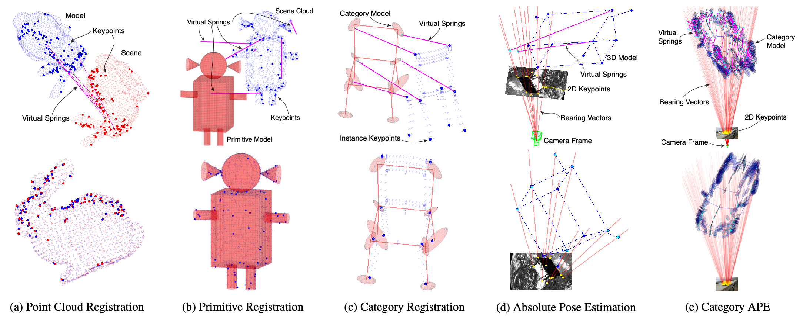

# Dynamical Pose Estimation

This repository is the official Matlab implementation of [Dynamical Pose Estimation](https://arxiv.org/abs/2103.06182), which has been accepted to be published in the _International Conference on Computer Vision (ICCV)_, 2021.

If you find this implementation useful for your research, please cite:
```bibtex
@InProceedings{Yang21ICCV-DAMP,
    title={Dynamical Pose Estimation},
    author={Yang, Heng and Doran, Chris and Slotine, Jean-Jacques},
    booktitle={International Conference on Computer Vision (ICCV)},
    year={2021}
}
```

For a quick summary of this paper, please watch the [**video presentation**](https://youtu.be/CDYXR1h98Q4).


## About

 We propose **DynAMical Pose estimation (DAMP)**, the first general and practical framework to perform pose estimation from 2D and 3D visual correspondences by simulating **rigid body dynamics** arising from **virtual springs and damping** (top row, magenta lines). DAMP almost always returns the globally optimal rigid transformation across five pose estimation problems (bottom row). (a) Point cloud registration using the Bunny dataset; (b) Primitive registration using a robot model of spheres, planes, cylinders and cones; (c) Category registration using the chair category from the PASCAL3D+ dataset; (d) Absolute pose estimation (APE) using the SPEED satellite dataset; (e) Category APE using the FG3DCar dataset.

## Examples
Simply run `example_XXX.m` files to see the satisfying dynamical pose estimation!
